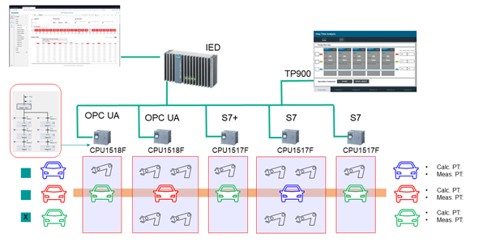

# Performance Analytics

Below you can find the structure of this use case:

- [Performance Analytics](#performance-analytics)
  - [Description](#description)
    - [Overview](#overview)
    - [General Task](#general-task)
  - [Requirements](#requirements)
    - [Prerequisites](#prerequisites)
    - [Used components](#used-components)
  - [Configuration steps](#configuration-steps)
  - [Documentation](#documentation)
  - [Contribution](#contribution)
  - [Licence and Legal Information](#licence-and-legal-information)

## Description

### Overview
The 'Step Time Analysis' dashboard of the Edge App 'Performance Insight' is used to assess the efficiency of the implemented sequential control systems. First, it needs to be synchronized with the asset model of the plant, representing the control systems in operation. This synchronization allows for the establishment of a reference duration for each step in the process. Then, the configured (or expected) step time is compared with the actual measured time during operation. 

This comparison makes it easier to identify specific steps in the production process that are experiencing delays, thereby enabling more targeted and efficient corrective actions.

This specific example shows how an exemplary production line is connected, the data from the plant is transferred to the edge system and evaluated there. This is shown using the step time analysis of a simulated automobile production with 5 assembly stations and randomly delayed steps.

### General Task

This sample application is based on five S7-1500 PLCs to control the manufacturing process of cars. A sequential control system that was implemented with the TIA Portal programming language “Graph” runs on each PLC. 

The Industrial Edge Device connects to the PLCs using different protocols:

- **PLC 1** sends the "Station 1" data to the Edge Device by OPC UA using the "OPC UA Connector".
- **PLC 2** sends the "Station 2" data to the Edge Device by OPC UA using the "OPC UA Connector"
- **PLC 3** sends the "Station 3" data to the Edge Device by Optimized S7 Protocol (S7+) using the "S7 Connector".
- **PLC 4** sends the "Station 4" data to the Edge Device by Optimized S7 Protocol (S7+) using the "S7 Connector".
- **PLC 5** sends the "Station 5" data to the Edge Device by Optimized S7 Protocol (S7+) using the "S7 Connector".

And after setting other connections requirements on the Edge Device (Explained in the [Configuration Steps](#configuration-steps)) we can use this data on the **Step Time Analysis** dashboard of the **Performance Insights** app.

For each implemented step the PLC shall provide a tag that carries the step activity status. For each sequential control an asset model with the activity status of the step needs to be configured and connected with the related PLC status tags. 

The option “Step time analysis” of the Edge App “Performance Insight” needs to be aligned with the asset model that represents the implemented sequential control systems in order to assign a reference duration for each step. This dashboard of the Edge App “Performance Insight” compares the configured and measured step time which allows localizing the steps that are causing delays.

## Requirements

### Prerequisites
* Industrial Edge Learning Path (Module 1-3)
*	Access to an Industrial Edge Management System (IEM)
*	Onboarded Industrial Edge Device (IED) on Industrial Edge Management
*	Establish connection to 5 PLCs for getting data into the Edge Device
*	Installed system configurators (S7 Connector Configurator, Databus Configurator)
*	Installed apps on IED (S7 Connector, Databus, IIH Essentials, Performance Insight)
*	Google Chrome (Version ≥ 72)

### Used components
TIA and PLC:

*	TIA Portal V16
*	PLC1: CPU 1518F-4 PN/DP FW 2.8
*	PLC2: CPU 1518F-4 PN/DP FW 2.8
*	PLC3: CPU 1517TF-3 PN/DP FW 2.8
*	PLC4: CPU 1517F-3 PN/DP FW 2.8
*	PLC5: CPU 1517TF-3 PN/DP FW 2.8
*	HMI: TP900 Comfort

Industrial Edge:

*	Industrial Edge Management OS V1.5.2-4
*	Industrial Edge Virtual Device V1.16.1-1-a
*	SIMATIC S7 Connector V2.0.0-1
* OPC UA Connector V2.0.1-0
* Common Import Converter V2.0.0-1
* Common Connector Configurator V1.9.1-1
* Registry Service V1.9.0-0
*	Databus V2.3.1
*	Databus Configurator V 2.3.1-4
*	IIH Essentials V1.9.0
*	Performance Insight V1.16.1

## Configuration Steps

You can find further information about the following steps in the [docs](docs/Installation.md):

-	Configure PLC project in TIA Portal
- Configure PLC connections in Industrial Edge
  - Configure Databus
  - Configure PLC Connectors
- Configure IIH Essentials
  - Enter Databus Credentials.
  - Link Connectors to IIH.
  - Configure Assets
  - Configure Aspects
- Configure Performance Insight
  - Defining limits
  - Show step time analysis

## Documentation

You can find further documentation and help in the following links

* [Industrial Edge Hub](https://iehub.eu1.edge.siemens.cloud/#/documentation)
* [Industrial Edge Forum](https://www.siemens.com/industrial-edge-forum)
* [Industrial Edge landing page](https://new.siemens.com/global/en/products/automation/topic-areas/industrial-edge/simatic-edge.html)
* [Industrial Edge GitHub page](https://github.com/industrial-edge)
* [Industrial Edge Learning Path](https://siemens-learning-simaticedge.sabacloud.com)

## Contribution

Thank you for your interest in contributing. Anybody is free to report bugs, unclear documentation, and other problems regarding this repository in the Issues section.
Additionally everybody is free to propose any changes to this repository using Pull Requests.

If you haven't previously signed the [Siemens Contributor License Agreement](https://cla-assistant.io/industrial-edge/) (CLA), the system will automatically prompt you to do so when you submit your Pull Request. This can be conveniently done through the CLA Assistant's online platform. Once the CLA is signed, your Pull Request will automatically be cleared and made ready for merging if all other test stages succeed.

## Licence and Legal Information

Please read the [Legal information](LICENSE.md).
