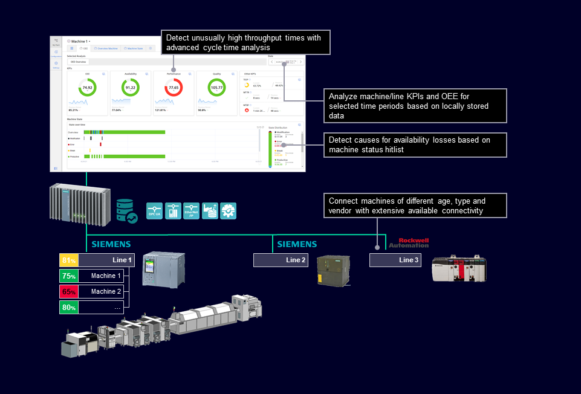
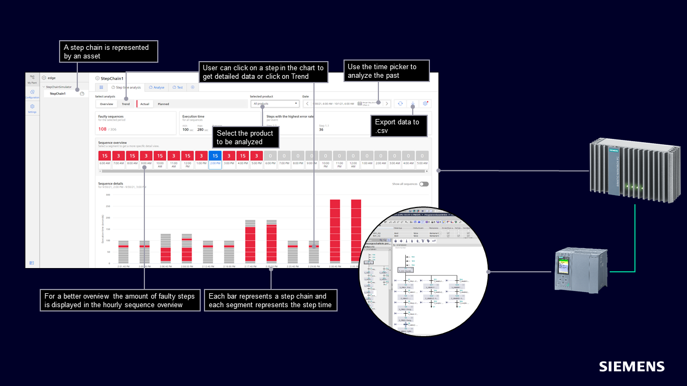

# Anchor-Use-Case-Plug-and-Analyze 

Below you can find the structure of this use case:

* [Anchor-Use-Case-Plug-and-Analyze](#anchor-use-case-plug-and-analyze)
  * [Description](#description)
    * [Overview](#overview)
    * [General Task](#general-task)
  * [Requirements](#requirements)
    * [Prerequisites](#prerequisites)
    * [Used components](#used-components)
  * [Configuration-steps](#configuration-steps)
  * [Documentation](#documentation)
  * [Contribution](#contribution)
  * [Licence and Legal Information](#licence-and-legal-information)

## Description

### Overview
With the help of this use case, it is shown how added value can be gained from the production data. This step time analysis can identify the causes of efficiency losses with a performance monitoring and analysis solution. This gives you better insights into production and allows you to derive actions. The solution is also suitable for existing systems. This specific example shows how an exemplary production line is connected, the data from the plant is transferred to the edge system and evaluated there. This is shown using the step time analysis of a fictitious automobile production with 5 stations and randomly delayed steps.

### General Task

This sample application is based on five S7-1500 PLCs to control the manufacturing process of a car. A sequential control system that was implemented with the TIA Portal programming language “Graph” runs on each PLC. The Industrial Edge Device shall be connected to PLC 1 + 2 via OPC UA, to PLC 3 via S7+ protocol and to PLC 4 + 5 via S7 protocol using the system Edge App “S7 Connector”. For each implemented step the connectivity shall provide a tag that carries the step activity status. For each sequential control an asset model with the activity status needs to be configured and aligned with the related status tags. The option “Step time analysis” of the Edge App “Performance Insight” needs to be aligned with the asset model that represents the implemented sequential control systems in order to assign a reference duration for each step. The dashboard of the Edge App “Performance Insight” compares the configured and measured duration which allows localizing the steps that are causing delays.

## Requirements

### Prerequisites
* Industrial Edge Learning Path (Module 1-3)
*	Onboarded Industrial Edge Device (IED) on Industrial Edge Management
*	Access to an Industrial Edge Management System (IEM)
*	Establish connection to 5 PLCs for getting data into the Edge Device
*	Installed system configurators (S7 Connector Configurator, Databus Configurator)
*	Installed apps on IED ( S7 Connector, Databus, Data Service, Performance Insight)
*	Google Chrome (Version ≥ 72)

### Used components
TIA and PLC:

*	TIA Portal V16
*	PLC1: CPU 1518F-4 PN/DP FW 2.8
*	PLC2: CPU 1518F-4 PN/DP FW 2.8
*	PLC3: CPU 1517TF-3 PN/DP FW 2.8
*	PLC4: CPU 1517F-3 PN/DP FW 2.8
*	PLC5: CPU 1517TF-3 PN/DP FW 2.8
*	HMI: TP900 Comfort

Industrial Edge:

*	Industrial Edge Management V 1.3.10
*	Industrial Edge Device V 1.3.0-57
*	SIMATIC S7 Connector V 1.3.0-57
*	SIMATIC S7 Connector Configurator V 1.3.48
*	IE Databus V 1.3.5
*	IE Databus Configurator V 1.3.5
*	Data Service V 1.3.0-11313182
*	Performance Insight V 1.3.1-11446312
*	Webbrowser (Google Chrome)

## Configuration steps

You can find further information about the following steps in the [docs](docs/Installation.md#configuration-steps)
-	Configure PLC project in TIA Portal
- Configure PLC connections in Industrial Edge
  - Configure Databus
  - Configure S7 Connector
- Configure Data Service
  - Configure the adapter
  - Configure an asset with variables
- Configure Performance Insight
  - Defining limits
  - Show step time analysis

## Documentation

You can find further documentation and help in the following links

* [Industrial Edge Hub](https://iehub.eu1.edge.siemens.cloud/#/documentation)
* [Industrial Edge Forum](https://www.siemens.com/industrial-edge-forum)
* [Industrial Edge landing page](https://new.siemens.com/global/en/products/automation/topic-areas/industrial-edge/simatic-edge.html)
* [Industrial Edge GitHub page](https://github.com/industrial-edge)
* [Industrial Edge Learning Path](https://siemens-learning-sitrainaccess.sabacloud.com/Saba/Web_spf/EU2PRD0112/app/shared;spf-url=common%2Flearningeventdetail%2Fcurra000000000005180%3Freturnurl%3Dcommon%2Fcategorydetail%2Fcateg000000000006660%3FembeddedInTorque%3Dtrue)

## Contribution

Thank you for your interest in contributing. Anybody is free to report bugs, unclear documentation, and other problems regarding this repository in the Issues section. Everybody is free to propose any changes to this repository using Pull Requests.

## Licence and Legal Information

Please read the [Legal information](LICENSE.md).
