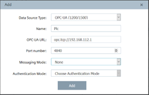
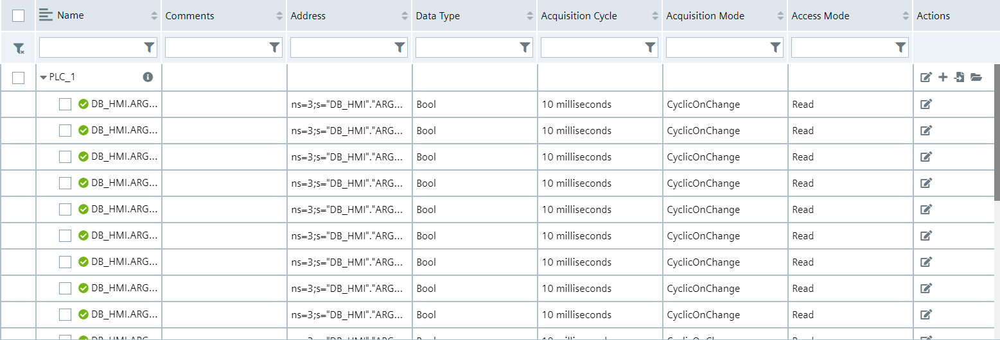
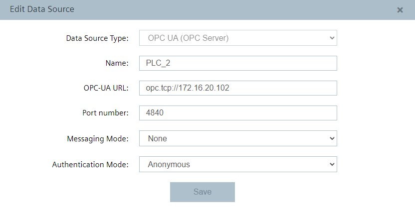

# Configuration Steps

- [Configuration steps](#configuration-steps)
- [Configure PLC project in TIA Portal](#configure-plc-projectin-tia-portal)
- [Configure PLC connections in Industrial Edge](#configure-plc-connectionsin-industrial-edge)
  - [Configure Databus](#configure-databus)
  - [Configure S7 Connector](#configure-s7-connector)
- [Configure Data Service](#configure-data-service)
  - [Configure the adapter](#configure-the-adapter)
  - [Configure an asset with variables](#configure-an-asset-with-variables)
- [Configure Performance Insight](#configure-performance-insight)
  - [Defining limits](#defining-limits)
  - [Show step time analysis](#show-step-time-analysis)
  

## Configure PLC project in TIA Portal
This use case contains a TIA project which simulate the process. The project also inclunde a HMI visualization to operate the demonstration process. Download the TIA Portal project [here](/StepTimeAnalysis.zip). The first steps are to configure the PLC project and the intruduction into the HMI screens.

1.	Open TIA portal and open the project containing the car production application (Adapt the PLC type and IP addresses to your system for each PLC and HMI)

2.	Download the PLC program to the PLCs and set the PLCs into RUN
3.	Open the HMI to control the car production application

Global Screen:
* Switch between automatic and manual mode of the stations
* Select which car typ should be produce
* See which car typ is actually in production in each station
* Check status of the stations
* See the calculated and measured production time for each car type
* Start and stop the sequential control system in the stations
* Switch to the screens for every station 

Station Screen:
* Switch between automatic and manual mode for the selected station (Only when status is Idle)
* Select the car type with the dropdown menu in manual mode
* After selecting the car type start the sequential control
* Stop and reset the sequential control
* See the status of the station
* See the car type in the station in automatic mode
* Switch to the delay select screen ("Simulate values")

Delay Select Screen:
* Reachable via button “Simulate values” on each station
* Select which step should be delayed
* When the step is selected, a random time between 0 and 10 seconds is added to the step

## Configure PLC Connections in Industrial Edge

We switching now to the Edge part of this use case. Each of the following steps is done in the Industrial Edge system. We use S7 Connector at the Edge side to read data from the PLCs and provide the data. The data from the CPU are transferred via OPC UA, S7 and S7+. The data is sent via the S7 connector to the Databus, where the Data Service can use the data. In order to build this infrastructure, these apps must be configured correctly:

* Databus
* S7 Connector

### Configure Databus

Open the Industrial Edge Management and launch the Databus configurator.

When the configurator is open, add a user with the topic: `ie/#`

Deploy the configuration.

### Configure S7 Connector

Open the S7 Connector in your Management and launch the configurator.

Add a new data source for PLC1 with the OPC-UA connector:

Add the needed tags:

The "active" variables of the individual steps are those that are in DB_HMI and named with "DB_HMI"."ARG1_Seq1_S1" to "DB_HMI"."ARG1_Seq1_S19". Also add the String Variable for the Product "DB_Process_Var"."Car_Type_inProduction_Text".

Add a second data source for PLC2 also with the OPC-UA connector:

Add the needed tags for PLC2 in the same way. Add the tags for the steps and the tag for the product.

The third PLC is added as a data source with the following parameters with the S7 Connector:

Also add the same tags from PLC3.

PLC4 and PLC5 are used as data sources with the S7 protocol:

Add for these PLCs the tags respectively.

Edit the settings:

Hint: Username and password should be the same for all system apps, e.g. "edge" / "edge".

Deploy the project and start it.

## Configure Data Service
Steps are created for an asset as aspects in the data service. An asset represents the stations and for each asset the aspects represents the steps. Performance Insight will use this structure of assets and aspects in the Data Service. Open the web interface of your Edge Device and launch the Data Service app. 

### Configure the adapter

Select the available "adapters" on the left and choose the SIMATIC S7 Connector. Click the edit icon on the right to open the adapter configuration.

Add the missing entries for username and password (again "edge"/"edge") and save it.

### Configure an asset with variables

Click on the icon "Assets & Connectivity" on the left bar. Add a child asset for the main "edge" asset. Into this child asset add 5 subassets for the stations.

Add for every step aspects. The first step of each branch (step 2 and step 11) must be configured as initial step. 

First step of the branch:

Following steps of the branch:

Connect the aspects with the connector.

Repeat this process for every station.

## Configure Performance Insight

When the Data Service and the assets and aspects are configured and created, open the Performance Insight application on the IED. With this appliation it is possible to get information about the duration of defined steps and the observation of limits of individual steps and sequences.

The steps and stations are automatically applied in Performance Insight. The next step is to specify the limits for each step in the asset configuration.

### Defining Limits

To set the limits for the steps in the sequential control system, click on the gear icon on the right.

Choose a product from the list of available products. Click on the gear icon of the product. 

A list with all steps of this product is displayed. Open the dropdown menu with the text "Apply to all step limits". Set the limit factor in percent and click Apply.

The time limits are set in the fields. Click the "Save" button.

### Show step time analysis

When you have created steps for the asset in the Data Service and when you have defined the limits then the step time analysis is automatically 
displayed in the "Step time analysis" dashboard.

With the help of the "Overview" screen you can get all information of the sequences of a specific product for a specified time period. When the step is gray the step time is within the defined limits. A red displayed step is a step which is toutside the defined limits.

The analysis overview is displayed in the "Step time analysis" dashboard with the following options:
* Switching to the trend view
* Displaying the number of faulty sequences
* Execution time of the faulty sequences
* Selecting a product for which the step time analysis is to be displayed
* Selecting a time period for which the step time analysis is to be displayed
* Downloading a report in CSV format
* Switching to the limit definition in the Asset Configuration
* Displaying the steps with highest fault rate
* Sequence overview: Display and selection of a specific sequence for detailed display
* "Show all sequences"
* Sequence details: Displaying all sequences in the selected time period and defined steps. When selecting a single step, the Trend view of the step opens.
