# Configuration Steps

- [Configuration Steps](#configuration-steps)
  - [Configure PLC project in TIA Portal](#configure-plc-project-in-tia-portal)
  - [Configure PLC Connections in Industrial Edge](#configure-plc-connections-in-industrial-edge)
    - [Configure Databus](#configure-databus)
    - [Configure PLC Connectors](#configure-plc-connectors)
  - [Configure IIH Essentials](#configure-iih-essentials)
    - [Configure the adapter](#configure-the-adapter)
    - [Configure an asset with variables](#configure-an-asset-with-variables)
  - [Configure Performance Insight](#configure-performance-insight)
    - [Defining Limits](#defining-limits)
    - [Show step time analysis](#show-step-time-analysis)

In order to set up the 'Step Time Analysis' dashboard within the Performance Insights application, it is essential to understand the flow of data across the system. The following diagram illustrates how data is communicated from the PLCs to the Industrial Edge Device, and subsequently processed by the Edge applications:

To achieve this data flow, the following configurations will be explained:

1. **OPC UA Connector**: Configure the OPC UA Connector to establish communication with PLC 1 and PLC 2. Ensure that the OPC UA servers on these PLCs are set up to allow for data exchange.

2. **S7 Connector**: Set up the S7 Connector to facilitate data transfer from PLC 3 using the S7+ protocol, and from PLC 4 and PLC 5 via the standard S7 protocol.

3. **Databus Configuration**: Integrate the MQTT-Broker to allow for a seamless data flow from the OPC UA and S7 Connectors to the higher-level Industrial Edge Applications.

4. **IIH Essentials**: Install and configure the IIH Essentials application to ensure that the core industrial data from your PLCs can be effectively harnessed and utilized by the Edge Device. This setup is crucial for enabling comprehensive data collection and subsequent analysis within the Performance Insights application.

5. **Performance Insights Application Setup**: Within the Performance Insights application, configure the 'Step Time Analysis' feature by linking it to the respective asset models, which reflect the status of the sequential control steps from the PLCs.

## Configure PLC project in TIA Portal
This use case contains a TIA project which simulates the process. The project also inclundes a HMI visualization to operate the demonstration process. Download the TIA Portal project [here](../src/StepTimeAnalysis_20221129_1438.7z). The first steps are to configure the PLC project and the intruduction into the HMI screens.

1.	Open TIA portal and open the project containing the car production application (Adapt the PLC type and IP addresses to your system for each PLC and HMI)

2.	Download the PLC program to the PLCs and set the PLCs into RUN
3.	Open the HMI to control the car production application

Global Screen:
* Switch between automatic and manual mode of the stations
* Select which car type should be produced
* See which car type is actually in production in each station
* Check status of the stations
* See the calculated and measured production time for each car type
* Start and stop the sequential control system in the stations
* Switch to the screens for every station 

Station Screen:
* Switch between automatic and manual mode for the selected station (Only when status is Idle)
* Select the car type with the dropdown menu in manual mode
* After selecting the car type start the sequential control
* Stop and reset the sequential control
* See the status of the station
* See the car type in the station in automatic mode
* Switch to the delay select screen ("Simulate values")

Delay Select Screen:
* Reachable via button “Simulate values” on each station
* Select which step time should be delayed
* When the step is selected, a random time between 0 and 10 seconds is added to the step

## Configure PLC Connections in Industrial Edge

We are now switching to the Edge part of this use case. Each of the following steps are done in the Industrial Edge system and, as explained in the Data Flow picture [above](#flow-data), we use the S7 Connector and OPC UA Connector on the Industrial Edge Device (IED) to read data from the PLCs and provide the data. Then, the data is sent via the connectors to the Databus, where the IIH Essentials can use the information for enabling comprehensive data collection and subsequent analysis within the Performance Insights application.

In order to build this infrastructure, first, these apps must be configured correctly:

* Databus
* OPC UA Connector
* S7 Connector

### Configure Databus

Go to the *Industrial Edge Management UI > Data Connections*, select "Databus" and launch it on the onboarded Edge Device.

When the configurator is open, click on the "plus" icon in the red square shown in the picture bellow to add an user: 

Add an user with the topic: `ie/#`. In this use case we use the credentials "edge" / "edge". The credentials can be chosen freely but must be the same in all system apps. Select "Publish and Subscribe" as permission. And lastly, click "add"

Then, just click **Deploy** to apply the changes:

### Configure OPC UA Connector

In this part, connection with the first two PLCs are established using the OPC UA Connector. 

Go to the *Industrial Edge Management UI > Data Connections*, select "OPC UA Connector" and launch it on the onboarded Edge Device.

Add a new data source for PLC1 with the OPC UA connector by clicking on "Add Data Source":

Enter your OPC Server (PLC1) details as shown in the image and click "Add":

Add the needed tags. This can be done by browsing or adding them manually. In this case, click on the "browse tags" icon:

Select and add the tags that are named "DB_HMI"."ARG1_Seq1_S1" to "DB_HMI"."ARG1_Seq1_S19". Also add the String variable for the product "DB_Process_Var"."Car_Type_inProduction_Text":

This variables indicates if the respective step is active right now.

Now repeat the same process for the PLC2. 

Before deploying the changes, edit the databus settings:

Hint: Username and password should be the same as was set in the IE Databus configuration, e.g., "edge" / "edge".

Deploy the OPC UA Connector by clicking "Deploy". After deployment the "Bus Adaptor" and the "Data Source" status of both PLCs should have green icon, like so:

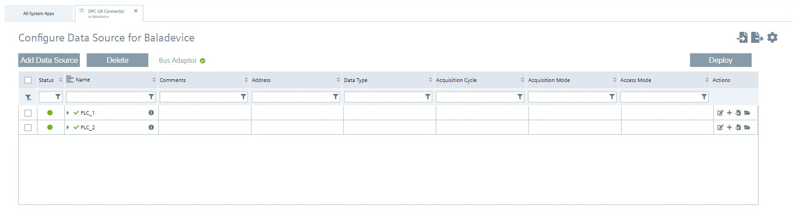

### Configure S7 Connector

The third PLC is added as a data source with the following parameters with the S7 Connector:

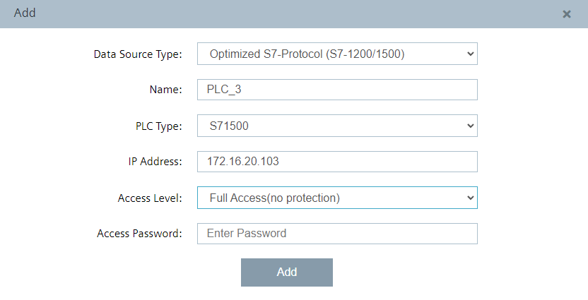

Also add the same tags from PLC3. Tag browsing also works with the S7+ protocol or add the tags manually.

PLC4 and PLC5 are used as data sources with the S7 protocol:

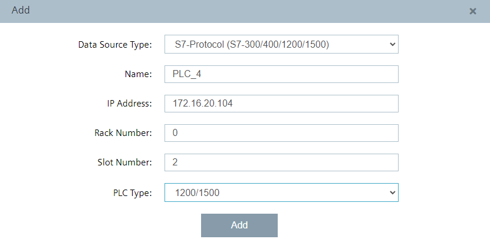

Add for these PLCs the tags respectively. With the S7 classic protocol it is only possible to add the tags manually.

Edit the settings:

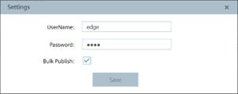

Hint: Username and password should be the same as was set in the IE Databus configuration, e.g., "edge" / "edge".

Deploy the S7 Connector configuration.

## Configure IIH Essentials
Steps are created for an asset as aspects in IIH Essentilas and automatically applied in Performance Insight. An asset represents, for this example, a car production "Station". and for each asset the aspects represents the steps. 

Performance Insight use this structure of assets and aspects to visualize the data in a later step. Open the web interface of your IED and launch the Data Service app. 

### Configure the adapter

Select the available "adapters" on the left and choose the SIMATIC S7 Connector. Click the edit icon on the right to open the adapter configuration.

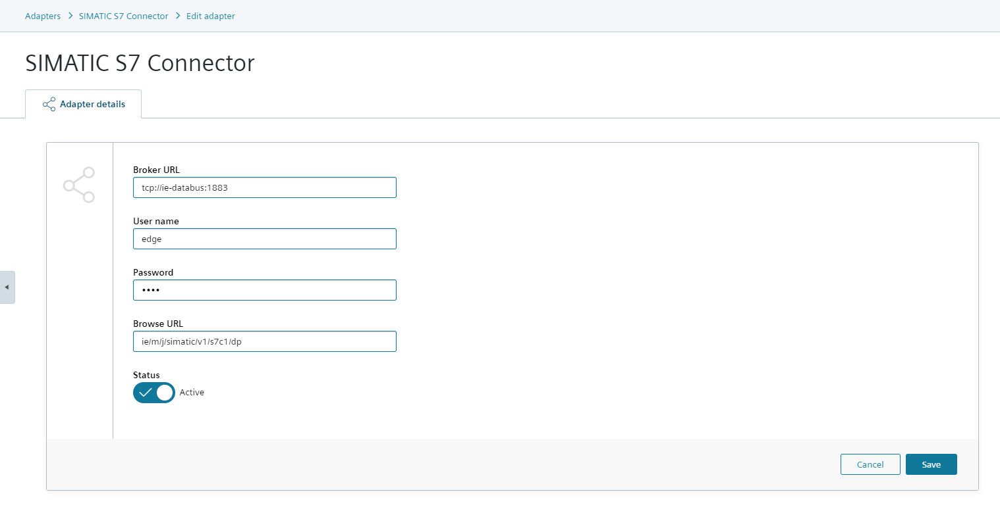

Add the missing entries for username and password (again "edge"/"edge") and save it.

Repeat this step for the OPC UA Connector.

### Configure an asset with variables

Click on the icon "Assets & Connectivity" on the left bar. Add a child asset for the main "edge" asset. Into this child asset add 5 subassets for the stations.

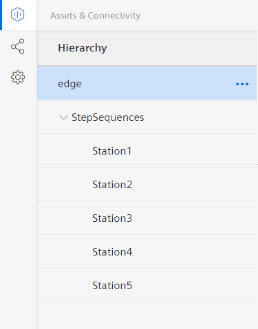

Create an aspect for every step. The first step of each branch (step 2 and step 11) must be configured as initial step. This is necessary to mark the beginning of the sequence and to link the corresponding product for the branch.

First step of the branch:

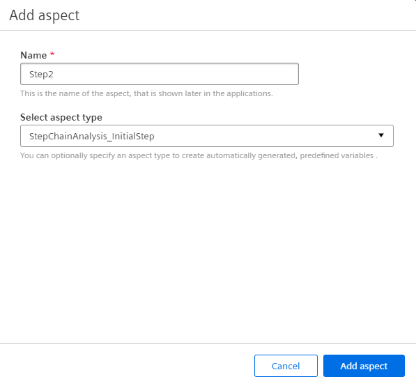

Following steps of the branch:

Link the variables that have been created by adding the aspects to the corresponding Connector tags.

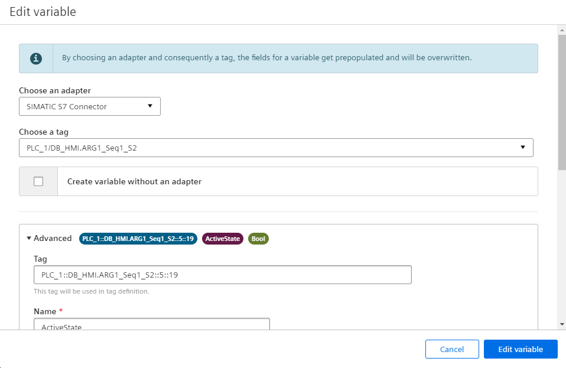

Repeat this process for every station.

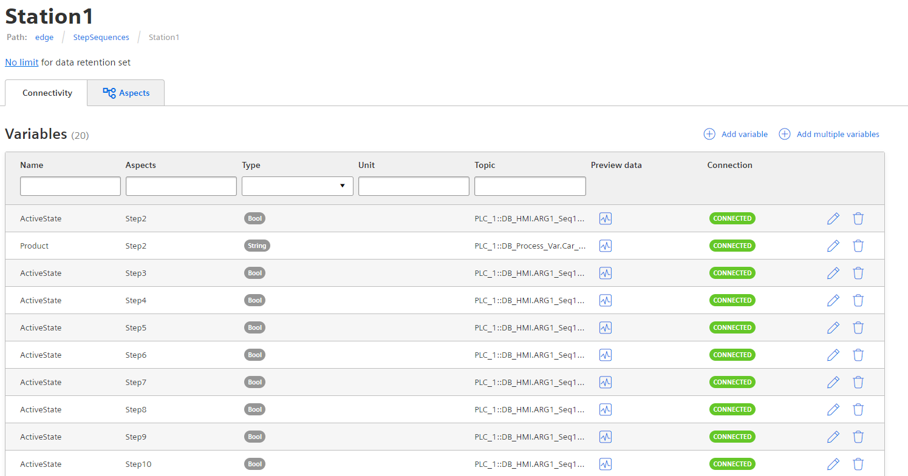

## Configure Performance Insight

After finishing the configuration of the Data Service, open the Performance Insight application on the IED. With this appliation it is possible to get information about the duration of defined steps and observe limits of individual steps and sequences.

The asset structure that was created in Data Service can also be found in Performance Insight. The next step is to specify the limits for each step in the asset configuration.

### Defining Limits

If no Step time analysis has yet been configured in Performance Insight, the "Define Limits" button is visible. Click on the button.

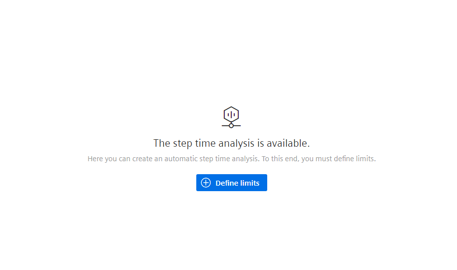

To change the limits for the steps in the sequential control system, click on the gear icon on the right.

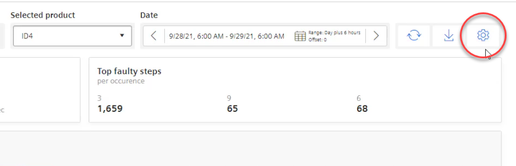

Choose a product from the list of available products. Click on the gear icon of the product. 

A list with all steps of this product is displayed. Open the dropdown menu with the text "Apply to all step limits". Specify a percentage (e.g. 5%) that is added to the initial value and click Apply. A limit is calculated for all steps based on the respective limits and entered in the "Planned step time limit" column.

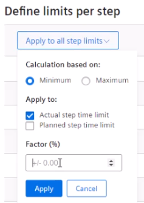

The time limits are set in the fields. Click the "Save" button.

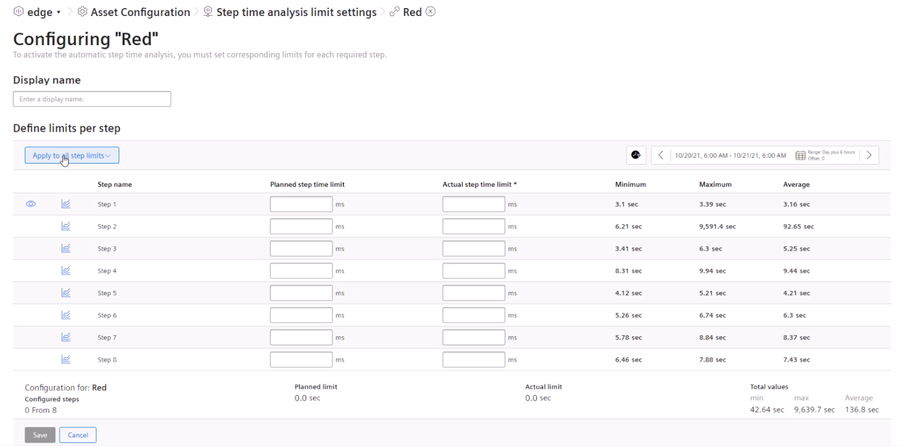

### Show step time analysis

When you have created steps for the asset in the Data Service and when you have defined the limits then the step time analysis is automatically 
displayed in the "Step time analysis" dashboard.

With the help of the "Overview" screen you can get all information about the sequences of a specific product for a specified time period. When the step is gray the step time is within the defined limits. A step displayed in red is outside the defined limits.

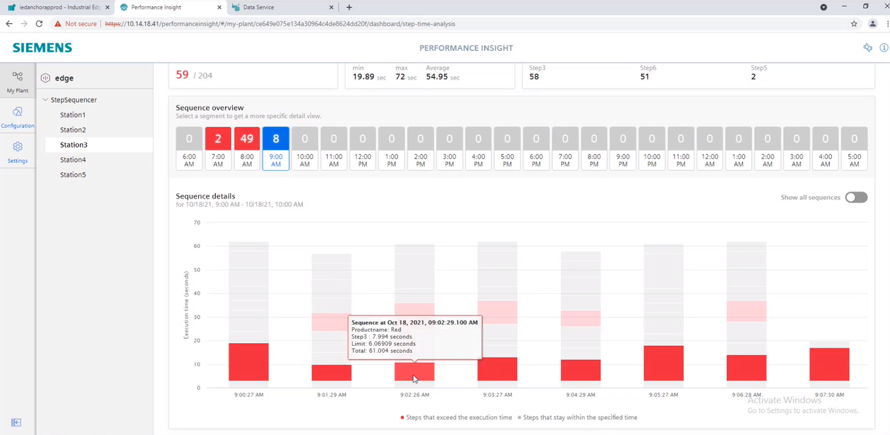

The analysis overview is displayed in the "Step time analysis" dashboard with the following options:
* Switching to the trend view
* Displaying the number of faulty sequences
* Execution time of the faulty sequences
* Selecting a product for which the step time analysis is to be displayed
* Selecting a time period for which the step time analysis is to be displayed
* Downloading a report in CSV format
* Switching to the limit definition in the Asset Configuration
* Displaying the steps with highest fault rate
* Sequence overview: Display and selection of a specific sequence for detailed display
* "Show all sequences"
* Sequence details: Displaying all sequences in the selected time period and defined steps. When selecting a single step, the Trend view of the step opens.
