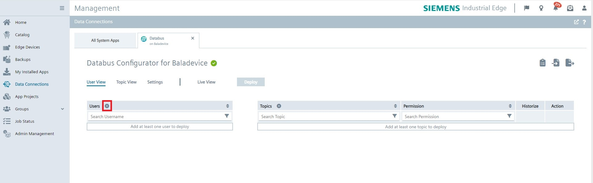
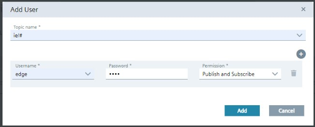
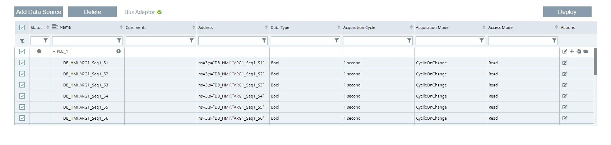
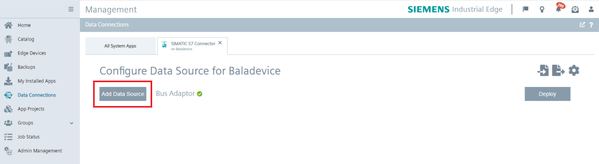

# Configuration Steps

- [Configuration Steps](#configuration-steps)
  - [Configure PLC project in TIA Portal](#configure-plc-project-in-tia-portal)
  - [Configure PLC Connections in Industrial Edge](#configure-plc-connections-in-industrial-edge)
    - [Configure Databus](#configure-databus)
    - [Configure PLC Connectors](#configure-plc-connectors)
  - [Configure IIH Essentials](#configure-iih-essentials)
    - [Enter Databus Credentials](#enter-databus-credentials)
    - [Link Connectors to IIH](#link-connectors-to-iih)
    - [Configure Assets](#configure-assets)
    - [Configure Aspects](#configure-aspects)
  - [Configure Performance Insight](#configure-performance-insight)
    - [Defining Limits](#defining-limits)
    - [Show step time analysis](#show-step-time-analysis)

In order to set up the 'Step Time Analysis' dashboard within the Performance Insights application, it is essential to understand the flow of data across the system. The following diagram illustrates how data is communicated from the PLCs to the Industrial Edge Device, and subsequently processed by the Edge applications:

To achieve this data flow, the following configurations will be explained:

1. **OPC UA Connector**: Configure the OPC UA Connector to establish communication with PLC 1 and PLC 2. Ensure that the OPC UA servers on these PLCs are set up to allow for data exchange.

2. **S7 Connector**: Set up the S7 Connector to facilitate data transfer from PLC 3, PLC 4 and PLC 5 using the S7+ protocol.

3. **Databus Configuration**: Integrate the MQTT-Broker to allow for a seamless data flow from the OPC UA and S7 Connectors to the higher-level Industrial Edge Applications.

4. **IIH Essentials**: Install and configure the IIH Essentials application to ensure that the core industrial data from your PLCs can be effectively harnessed and utilized by the Edge Device. This setup is crucial for enabling comprehensive data collection and subsequent analysis within the Performance Insights application.

5. **Performance Insights**: Within the Performance Insights application, configure the 'Step Time Analysis' feature by linking it to the respective asset models, which reflect the status of the sequential control steps from the PLCs.

## Configure PLC project in TIA Portal
This use case contains a TIA project which simulates the process. The project also inclundes a HMI visualization to operate the demonstration process. Download the TIA Portal project [here](../src/StepTimeAnalysis_20221129_1438.7z). The first steps are to configure the PLC project and the intruduction into the HMI screens.

1.	Open TIA portal and open the project containing the car production application (Adapt the PLC type and IP addresses to your system for each PLC and HMI)

2.	Download the PLC program to the PLCs and set the PLCs into RUN
3.	Open the HMI to control the car production application

Global Screen:
* Switch between automatic and manual mode of the stations
* Select which car type should be produced
* See which car type is actually in production in each station
* Check status of the stations
* See the calculated and measured production time for each car type
* Start and stop the sequential control system in the stations
* Switch to the screens for every station 

Station Screen:
* Switch between automatic and manual mode for the selected station (Only when status is Idle)
* Select the car type with the dropdown menu in manual mode
* After selecting the car type start the sequential control
* Stop and reset the sequential control
* See the status of the station
* See the car type in the station in automatic mode
* Switch to the delay select screen ("Simulate values")

Delay Select Screen:
* Reachable via button “Simulate values” on each station
* Select which step time should be delayed
* When the step is selected, a random time between 0 and 10 seconds is added to the step

## Configure PLC Connections in Industrial Edge

We are now switching to the Edge part of this use case. Each of the following steps are done in the Industrial Edge system and, as explained in the Data Flow picture [above](#flow-data), we use the S7 Connector and OPC UA Connector on the Industrial Edge Device (IED) to read data from the PLCs and provide the data. Then, the data is sent via the connectors to the Databus, where the IIH Essentials can use the information for enabling comprehensive data collection and subsequent analysis within the Performance Insights application.

In order to build this infrastructure, first, these apps must be configured correctly:

* Databus
* OPC UA Connector
* S7 Connector

### Configure Databus

Go to the *Industrial Edge Management UI > Data Connections*, select "Databus" and launch it on the onboarded Edge Device.

When the configurator is open, click on the "plus" icon in the red square shown in the picture bellow to add an user: 

Add an user with the topic: `ie/#`. In this use case we use the credentials "edge" / "edge". The credentials can be chosen freely but must be the same in all system apps. Select "Publish and Subscribe" as permission. And lastly, click "add"

Then, just click **Deploy** to apply the changes:

### Configure OPC UA Connector

In this part, connection with the **first two PLCs** are established using the OPC UA Connector. 

Go to the *Industrial Edge Management UI > Data Connections*, select "OPC UA Connector" and launch it on the onboarded Edge Device.

Add a new data source for PLC1 with the OPC UA connector by clicking on "Add Data Source":

Enter your OPC Server (PLC1) details as shown in the image and click "Add":

Add the needed tags. This can be done by browsing or adding them manually. In this case, click on the "browse tags" icon:

The "active" variables of the individual steps are those that are in DB_HMI and named with "DB_HMI"."ARG1_Seq1_S1" to "DB_HMI"."ARG1_Seq1_S19". This variables indicates if the respective step is active right now. Also add the String variable for the product "DB_Process_Var"."Car_Type_inProduction_Text".

Now repeat the same process for the PLC2. 

Before deploying the changes, edit the databus settings:

Hint: Username and password should be the same as was set in the IE Databus configuration, e.g., "edge" / "edge".

Deploy the OPC UA Connector by clicking "Deploy". After deployment the "Bus Adaptor" and the "Data Source" status of both PLCs should have green icon, like so:

If any issue is presented when configuring the OPC UA Connector, check [documentation](https://support.industry.siemens.com/cs/document/109811051/opc-ua-connector?dti=0&lc=en-US)

### Configure S7 Connector

In this section, the communication with the **third, fourth and fifth PLCs** are configured using the S7 Connector; however, the communication is set up with the S7+ protocol.

Let's start with the PLC3 configuration. Go to the *Industrial Edge Management UI > Data Connections*, select "S7 Connector" and launch it on the onboarded Edge Device.

Add a new data source for PLC3 with the S7 Connector by clicking on "Add Data Source":

Enter your PLC3 details as shown in the image and click "Add":

Use the browse feature to add the same tags as in previous PLCs, similar to the method used during the OPC UA Connector configuration:

Now, repeat the same procedure for the fourth and fifth PLC.

Before deploying the connector, edit the databus settings:

Hint: Username and password should be the same as was set in the IE Databus configuration, e.g., "edge" / "edge".

Deploy the S7 Connector by clicking "Deploy". After deployment the "Bus Adaptor" and the "Data Source" status of all PLCs should have green icon, like so:

## Configure IIH Essentials

Steps are created for an asset as aspects in IIH Essentilas and automatically applied in Performance Insight. An asset represents, for this example, a car production "Station". and for each asset the aspects represents the steps. 

Performance Insight use this structure of assets and aspects to visualize the data in a later step. Open the web interface of your IED and launch the IIH Essentials app. 

### Enter Databus Credentials

Firstly, Databus needs to be configured on IIH Essentials. To do that go to *Edge Device UI > Apps*, open IIH Essentials and go to *Settings > Databus Settings*, click on the edit icon:

Enter the needed data and click **save**.

### Link Connectors to IIH

Secondly, connectors need to be configured on IIH Essentials. To achive this, go to *Connectors* tab and add the "OPC UA Connector" and "S7 Connector" using the plus icon:

Select the connectors and click the edit icon on the top right to open the connector configuration tab and switch the "Status" to active:

The status of both connectors must be "Active" and the connector indicator shows "Connected", as illustrated below:

Now, both connectors are correctly configured on IIH Essentials.

### Configure Assets

Click on the icon "Assets & Connectivity" on the left bar. Add a child asset for the main "edge" asset by clicking on the three points icon and select "Add child asset". Into this child asset add 5 subassets for the stations:

### Configure Aspects

Now, it's time to create the Steps that will be displayed in the **Step Time Analysis** dashboard on Performance Insights app. For every step, the PLC should supply a tag indicating the status of the step's activity.

For each station, Step 2 is designated as the initial step, and its aspect type is assigned as 'StepChainAnalysis_InitialStep'. To do this, go to *Station 1 > Aspects > Add Aspect* and type the "Step 2" settings:

For the remaining steps (3rd to 11th), assign the aspect type 'StepChainAnalysis_Step', as illustrated:

Link the variables created during aspect addition with their respective asset tags. For the initial step (Step 2), two variables were created. Link the 'ActiveState' variable to its corresponding status tag 'DB_HMI.ARG1_Seq1_S2' on the asset connectivity tab, as follows:

Then, link the variable "Product" to the tag '"DB_Process_Var"."Car_Type_inProduction_Text"' on the asset connectivity tab, as follows:

For the remaining steps (3rd to 11th), similarly link the 'ActiveState' variable to its respective tag, just as you did for Step 2. After this, all steps be in "connected" state:

Repeat this process for every station.

## Configure Performance Insight

After finishing the configuration of the IIH Essentials, open the Performance Insight application on the IED. With this appliation it is possible to get information about the duration of defined steps and observe limits of individual steps and sequences.

The asset structure that was created in IIH Essentials can also be found in Performance Insight, just click on the "My Plant" icon:

Select any station on the asset structure and you will see that an auto-generated "Step Time Analysis" dashboard got created by Performance Insights as soon as we created the steps on IIH Essentials, as shown in the picture above.

Select the 'Step Time Analysis' dashboard, and it will immediately appear on screen. If the TIA Portal project has been uploaded to the PLCs and the program initiated on the HMI, data should now display on the dashboard:

Here's a more detailed overview of the functions for the buttons and elements on the Step Time Analysis Dashboard:

1) Select a product for which the step time analysis is to be displayed.
2) Switch the trend view.
3) Select between "Actual" and "Planned" steps.
4) Execution time of the faulty sequences.
5) Displaying the steps with highest fault rate.
6) Select a period for which the step time analysis is to be displayed
7) Switch to the limit definition in the Step Time Analysis configuration.
8) Sequence overview: Display and selection of a specific sequence for detailed display.
9) Sequence details: Displaying all sequences and defined steps in the selected period. When selecting a single step, the 
Trend view of the step opens.

### Defining Limits

In this instance, a single sequence has occurred at Station 1, as depicted in the graphic above. Now, limits need to be defined in the Step Time Analysis configuration tab, as shown:

In the "​Limits​" column (yellow square), set the values for the planned and actual duration of the respective step. When the value is exceeded, the step is evaluated as faulty.

​Under "​Overview​" (green square), you can automatically assign a limit to all steps using a mathematical function. To use this function, follow these steps:

- ​Decide whether to assign the automatic limit to the actual, planned or all step limits.
- From the drop-down menu, you select the minimum or the maximum as initial value of the step.
- As the factor, you specify a percentage that is added to the initial value.
- Click "​Apply to all steps​".

​A limit is calculated for selected steps on the basis of the respective limit values and entered in the corresponding column for limit values. To save the changes and switch to the dashboard view, click "​Save​". ​If you want to continue working in the same view after saving, click "​Save​ & ​Continue​". To exit the view without saving, click "​Cancel​".

### Show step time analysis

When you have created steps for the asset in IIH Essentials and you have defined the limits then the step time analysis is automatically displayed in the "Step time analysis" dashboard.

With the help of the "Overview" screen you can get all information about the sequences of a specific product for a specified time period. When the step is gray the step time is within the defined limits. A step displayed in red is outside the defined limits.

For Example, The image above shows the Step Time Analysis overview screen where five sequences have been completed. In every sequence, only the 7th step took longer than the expected completion time, marking it as faulty in red.

